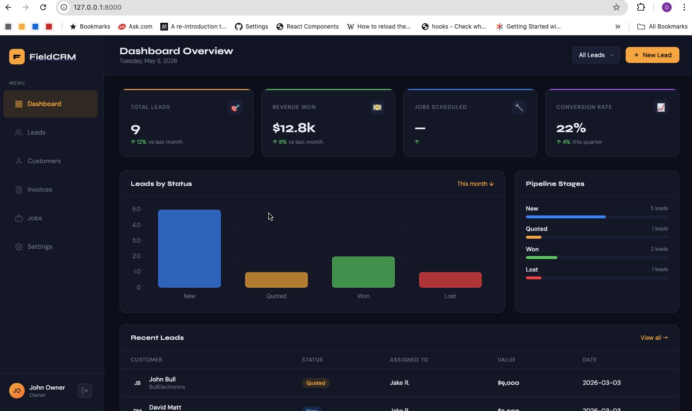
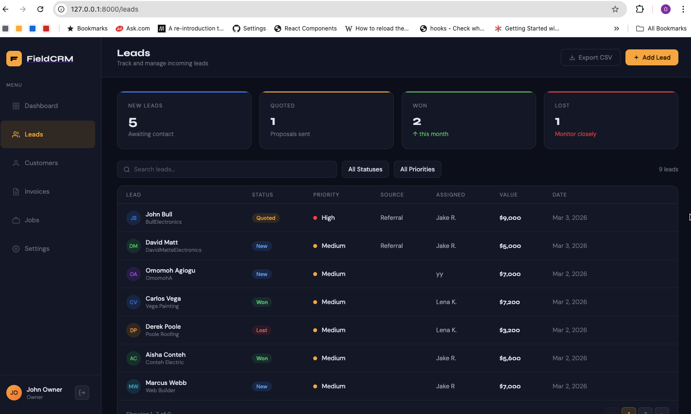
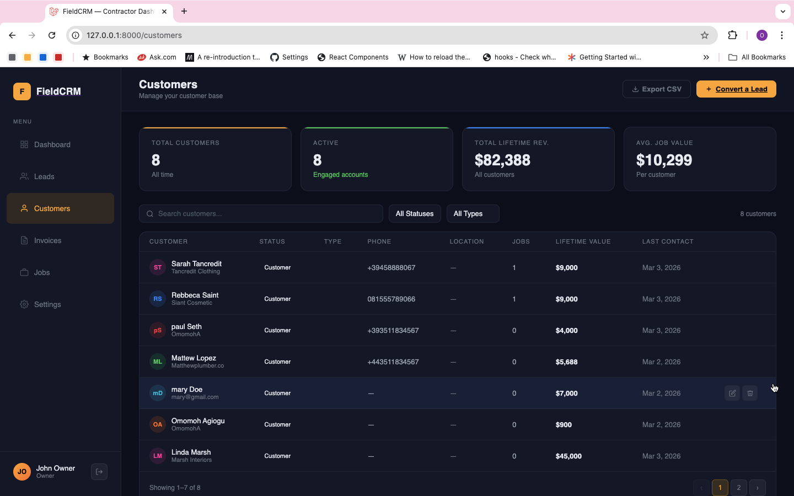
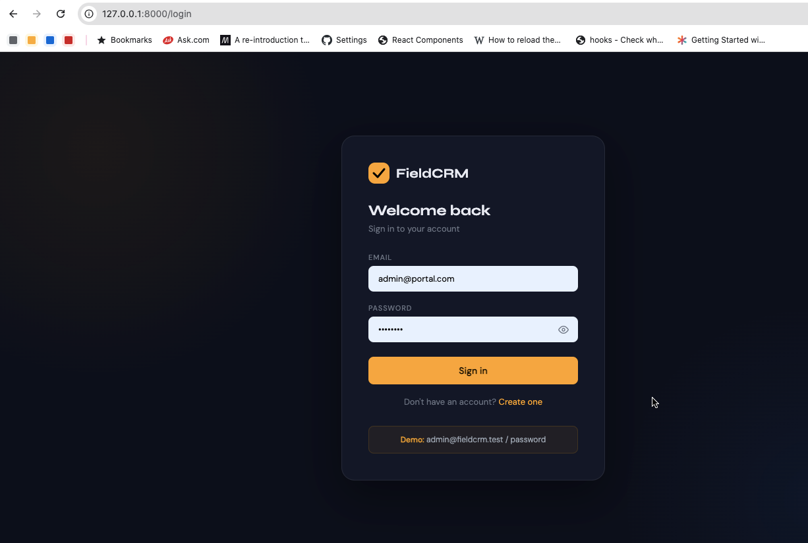

# FieldCRM – Laravel Backend Setup Guide

## Requirements
- PHP 8.2+
- Laravel 11
- MySQL 8+ (or SQLite for local dev)
- Composer

---

## 1. Install Sanctum

```bash
composer require laravel/sanctum
php artisan vendor:publish --provider="Laravel\Sanctum\SanctumServiceProvider"
```

---

## 2. Configure Environment

In `.env`:
```env
APP_URL=http://localhost:8000

DB_CONNECTION=mysql
DB_HOST=127.0.0.1
DB_PORT=3306
DB_DATABASE=fieldcrm
DB_USERNAME=root
DB_PASSWORD=

SANCTUM_STATEFUL_DOMAINS=localhost:3000,localhost:5173
SESSION_DOMAIN=localhost
```

---

## 3. Enable Sanctum Middleware

In `bootstrap/app.php` (Laravel 11):
```php
->withMiddleware(function (Middleware $middleware) {
    $middleware->api(prepend: [
        \Laravel\Sanctum\Http\Middleware\EnsureFrontendRequestsAreStateful::class,
    ]);
})
```

---

## 4. Place the Files

Copy each file to its Laravel path:

| File | Destination |
|---|---|
| `routes/api.php` | `routes/api.php` |
| `app/Models/*.php` | `app/Models/` |
| `app/Http/Controllers/Api/*.php` | `app/Http/Controllers/Api/` |
| `app/Http/Requests/*.php` | `app/Http/Requests/` |
| `app/Http/Requests/Auth/*.php` | `app/Http/Requests/Auth/` |
| `database/migrations/*.php` | `database/migrations/` |
| `database/seeders/DatabaseSeeder.php` | `database/seeders/` |

---

## 5. Run Migrations & Seed

```bash
php artisan migrate:fresh --seed
```

This creates the demo account:
- **Email:** `admin@fieldcrm.test`
- **Password:** `password`

---

## 6. CORS Configuration

In `config/cors.php`:
```php
'paths'           => ['api/*', 'sanctum/csrf-cookie'],
'allowed_origins' => ['http://localhost:5173', 'http://localhost:3000'],
'allowed_headers' => ['*'],
'allowed_methods' => ['*'],
'supports_credentials' => true,
```

---

## 7. Connect Your Vue Frontend

In Vue, set up Axios with authentication:

```js
// resources/js/api.js
import axios from 'axios'

const api = axios.create({
  baseURL: '/api',
  headers: {
    'Accept': 'application/json',
    'Content-Type': 'application/json',
  },
})

// Attach token from localStorage
api.interceptors.request.use(config => {
  const token = localStorage.getItem('auth_token')
  if (token) {
    config.headers.Authorization = `Bearer ${token}`
  }
  return config
})

// Redirect to login on 401
api.interceptors.response.use(
  response => response,
  error => {
    if (error.response?.status === 401) {
      localStorage.removeItem('auth_token')
      window.location.href = '/login'
    }
    return Promise.reject(error)
  }
)

export default api
```

Then in your Vue components:
```js
import api from '@/api'

// Login
const { data } = await api.post('/auth/login', { email, password })
localStorage.setItem('auth_token', data.token)

// Fetch leads
const { data } = await api.get('/leads', { params: { search, status, per_page: 15 } })
```

---

## API Reference

### Authentication

| Method | URL | Description |
|---|---|---|
| POST | `/api/auth/register` | Register new user |
| POST | `/api/auth/login` | Login → returns token |
| POST | `/api/auth/logout` | Revoke token |
| GET  | `/api/auth/me` | Get current user |

### Dashboard

| Method | URL | Description |
|---|---|---|
| GET | `/api/dashboard` | KPIs, pipeline, charts, recent activity |

### Leads

| Method | URL | Description |
|---|---|---|
| GET    | `/api/leads` | List (params: `search`, `status`, `priority`, `source`, `per_page`) |
| POST   | `/api/leads` | Create |
| GET    | `/api/leads/{id}` | Show |
| PUT    | `/api/leads/{id}` | Update |
| DELETE | `/api/leads/{id}` | Delete |
| GET    | `/api/leads/stats` | Counts & totals by status/source |

### Customers

| Method | URL | Description |
|---|---|---|
| GET    | `/api/customers` | List (params: `search`, `status`, `type`, `per_page`) |
| POST   | `/api/customers` | Create |
| GET    | `/api/customers/{id}` | Show (includes recent jobs) |
| PUT    | `/api/customers/{id}` | Update |
| DELETE | `/api/customers/{id}` | Delete |
| GET    | `/api/customers/stats` | Counts & revenue totals |

### Jobs

| Method | URL | Description |
|---|---|---|
| GET    | `/api/jobs` | List (params: `search`, `status`, `type`, `customer_id`, `per_page`) |
| GET    | `/api/jobs?per_page=0` | All jobs (for kanban) |
| POST   | `/api/jobs` | Create |
| GET    | `/api/jobs/{id}` | Show |
| PUT    | `/api/jobs/{id}` | Update |
| DELETE | `/api/jobs/{id}` | Delete |
| GET    | `/api/jobs/kanban` | Jobs grouped by status |
| GET    | `/api/jobs/stats` | Counts & revenue by status |

### Settings & Team

| Method | URL | Description |
|---|---|---|
| GET    | `/api/settings` | Get profile + preferences |
| PUT    | `/api/settings` | Update profile/password/preferences |
| DELETE | `/api/settings/account` | Delete own account |
| GET    | `/api/team` | List team members |
| DELETE | `/api/team/{id}` | Remove team member (admin only) |
| PATCH  | `/api/team/{id}/role` | Update member role (admin only) |

---

## Validation Error Format

All validation errors return `422` with this shape:
```json
{
  "message": "The email field is required.",
  "errors": {
    "email": ["The email field is required."]
  }
}
```

Handle in Vue:
```js
try {
  await api.post('/leads', form)
} catch (err) {
  if (err.response?.status === 422) {
    errors.value = err.response.data.errors
  }
}
```

---

## Useful Artisan Commands

```bash
# Re-run migrations with fresh seed data
php artisan migrate:fresh --seed

# Start dev server
php artisan serve

# List all API routes
php artisan route:list --path=api

# Clear config/route cache
php artisan optimize:clear
```

# FieldCRM – Laravel Backend Setup Guide

> **Note:** This repository contains the API backend. For the Vue frontend, see the [Frontend Repo Link].

## 🖼️ Visual Preview
| Dashboard Overview | Lead Management |
| :---: | :---: |
|  |  |

| Kanban Job Board | Front Page] |
| :---: | :---: |
|  |  |

---
